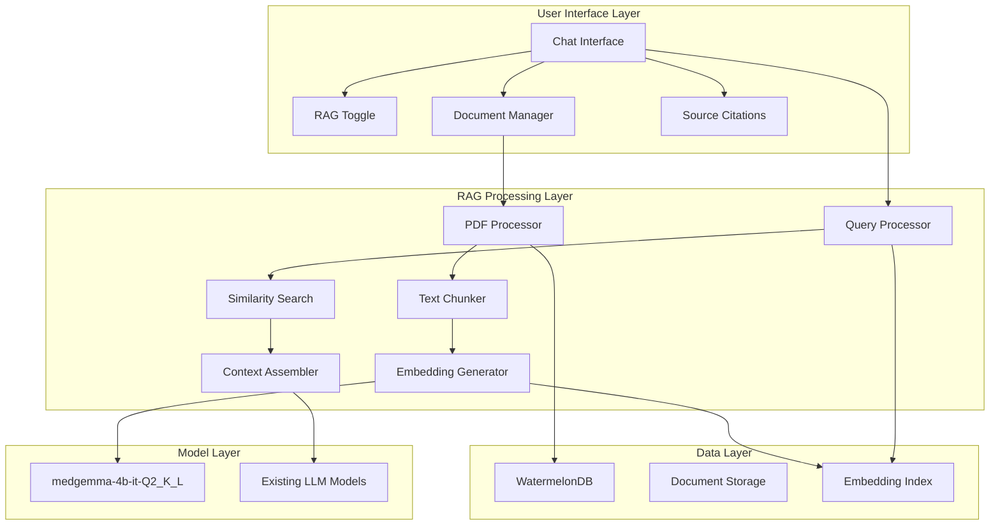

# Design Document

## Overview

The RAG (Retrieval-Augmented Generation) system will be integrated into the existing PocketPal AI application to enable document-aware conversations. The system will process PDF documents locally on iOS devices, create embeddings using the medgemma-4b-it-Q2_K_L model, store them in the existing WatermelonDB database, and retrieve relevant content during chat sessions to enhance AI responses with contextual information.

The design maintains PocketPal's core privacy-first approach by ensuring all processing happens on-device, while seamlessly integrating with the existing chat interface and model management system.

## Architecture

### High-Level Architecture



### Integration Points

1. **Chat Interface Integration**: RAG mode toggle in existing chat UI
2. **Model Store Integration**: medgemma-4b-it-Q2_K_L model management
3. **Database Integration**: New tables in existing WatermelonDB schema
4. **Message System Integration**: Enhanced message types with source citations

## Components and Interfaces

### 1. Document Management Component

**Purpose**: Handle PDF import, processing, and management

**Key Classes**:
- `DocumentManager`: Main orchestrator for document operations
- `PDFProcessor`: Extract text from PDF files using react-native-pdf or similar
- `DocumentMetadata`: Store document information and processing status

**Interfaces**:
```typescript
interface DocumentMetadata {
  id: string;
  name: string;
  filePath: string;
  size: number;
  pageCount: number;
  processedAt?: Date;
  isProcessed: boolean;
  chunkCount: number;
  isEnabled: boolean;
}

interface ProcessingStatus {
  documentId: string;
  status: 'pending' | 'processing' | 'completed' | 'failed';
  progress: number;
  error?: string;
}
```

### 2. Text Processing Component

**Purpose**: Chunk documents and prepare text for embedding generation

**Key Classes**:
- `TextChunker`: Split documents into manageable chunks
- `ChunkProcessor`: Clean and prepare text chunks

**Configuration**:
```typescript
interface ChunkingConfig {
  chunkSize: number; // Default: 512 tokens
  overlap: number; // Default: 50 tokens
  preserveSentences: boolean; // Default: true
  minChunkSize: number; // Default: 100 tokens
}
```

### 3. Embedding Generation Component

**Purpose**: Generate embeddings using medgemma-4b-it-Q2_K_L model

**Key Classes**:
- `EmbeddingGenerator`: Interface with medgemma model for embedding creation
- `EmbeddingCache`: Manage embedding storage and retrieval

**Interfaces**:
```typescript
interface DocumentChunk {
  id: string;
  documentId: string;
  text: string;
  pageNumber: number;
  chunkIndex: number;
  embedding?: number[];
  metadata: {
    startChar: number;
    endChar: number;
    tokens: number;
  };
}

interface EmbeddingResult {
  chunkId: string;
  embedding: number[];
  processingTime: number;
}
```

### 4. Retrieval Component

**Purpose**: Search and rank relevant document chunks for queries

**Key Classes**:
- `SimilaritySearch`: Perform cosine similarity calculations
- `ResultRanker`: Rank and filter search results
- `ContextAssembler`: Combine retrieved chunks into coherent context

**Interfaces**:
```typescript
interface SearchQuery {
  text: string;
  embedding: number[];
  maxResults: number; // Default: 5
  minSimilarity: number; // Default: 0.7
  documentIds?: string[]; // Optional filter
}

interface SearchResult {
  chunk: DocumentChunk;
  similarity: number;
  document: DocumentMetadata;
}

interface RetrievalContext {
  query: string;
  results: SearchResult[];
  totalChunks: number;
  processingTime: number;
}
```

### 5. RAG Chat Integration Component

**Purpose**: Integrate retrieval with existing chat system

**Key Classes**:
- `RAGChatSession`: Extended chat session with RAG capabilities
- `RAGMessageProcessor`: Process messages with document context
- `CitationManager`: Handle source citations and references

**Enhanced Message Types**:
```typescript
interface RAGMessageMetadata extends MessageType.Text['metadata'] {
  ragEnabled: boolean;
  retrievalContext?: RetrievalContext;
  citations?: Citation[];
}

interface Citation {
  documentId: string;
  documentName: string;
  pageNumber: number;
  chunkText: string;
  similarity: number;
}
```

## Data Models

### Database Schema Extensions

**New Tables**:

1. **rag_documents**
```sql
CREATE TABLE rag_documents (
  id TEXT PRIMARY KEY,
  name TEXT NOT NULL,
  file_path TEXT NOT NULL,
  size INTEGER NOT NULL,
  page_count INTEGER NOT NULL,
  processed_at INTEGER,
  is_processed BOOLEAN DEFAULT FALSE,
  chunk_count INTEGER DEFAULT 0,
  is_enabled BOOLEAN DEFAULT TRUE,
  created_at INTEGER NOT NULL,
  updated_at INTEGER NOT NULL
);
```

2. **rag_chunks**
```sql
CREATE TABLE rag_chunks (
  id TEXT PRIMARY KEY,
  document_id TEXT NOT NULL,
  text TEXT NOT NULL,
  page_number INTEGER NOT NULL,
  chunk_index INTEGER NOT NULL,
  embedding BLOB, -- Serialized embedding vector
  start_char INTEGER NOT NULL,
  end_char INTEGER NOT NULL,
  token_count INTEGER NOT NULL,
  created_at INTEGER NOT NULL,
  FOREIGN KEY (document_id) REFERENCES rag_documents(id) ON DELETE CASCADE
);
```

3. **rag_settings**
```sql
CREATE TABLE rag_settings (
  id TEXT PRIMARY KEY,
  chunk_size INTEGER DEFAULT 512,
  overlap INTEGER DEFAULT 50,
  max_results INTEGER DEFAULT 5,
  min_similarity REAL DEFAULT 0.7,
  preserve_sentences BOOLEAN DEFAULT TRUE,
  created_at INTEGER NOT NULL,
  updated_at INTEGER NOT NULL
);
```

### WatermelonDB Models

```typescript
// RAGDocument.ts
export default class RAGDocument extends Model {
  static table = 'rag_documents';
  
  @text('name') name!: string;
  @text('file_path') filePath!: string;
  @field('size') size!: number;
  @field('page_count') pageCount!: number;
  @field('processed_at') processedAt?: number;
  @field('is_processed') isProcessed!: boolean;
  @field('chunk_count') chunkCount!: number;
  @field('is_enabled') isEnabled!: boolean;
  @field('created_at') createdAt!: number;
  @field('updated_at') updatedAt!: number;
}

// RAGChunk.ts
export default class RAGChunk extends Model {
  static table = 'rag_chunks';
  
  @text('document_id') documentId!: string;
  @text('text') text!: string;
  @field('page_number') pageNumber!: number;
  @field('chunk_index') chunkIndex!: number;
  @text('embedding') embedding?: string; // JSON serialized array
  @field('start_char') startChar!: number;
  @field('end_char') endChar!: number;
  @field('token_count') tokenCount!: number;
  @field('created_at') createdAt!: number;
}
```

## Error Handling

### Error Categories

1. **Document Processing Errors**
   - PDF parsing failures
   - Unsupported file formats
   - Corrupted files
   - Insufficient storage space

2. **Embedding Generation Errors**
   - Model loading failures
   - Memory constraints
   - Processing timeouts
   - Invalid text content

3. **Retrieval Errors**
   - Database query failures
   - Embedding corruption
   - Search timeouts
   - No results found

### Error Recovery Strategies

1. **Graceful Degradation**: Fall back to normal chat mode if RAG fails
2. **Retry Mechanisms**: Automatic retry for transient failures
3. **User Feedback**: Clear error messages with actionable suggestions
4. **Partial Processing**: Allow partial document processing and incremental updates

### Error Handling Implementation

```typescript
interface RAGError {
  type: 'document' | 'embedding' | 'retrieval' | 'system';
  code: string;
  message: string;
  details?: any;
  recoverable: boolean;
}

class RAGErrorHandler {
  handleError(error: RAGError): Promise<void>;
  canRecover(error: RAGError): boolean;
  suggestRecovery(error: RAGError): string[];
}
```

## Testing Strategy

### Unit Testing

1. **Document Processing Tests**
   - PDF text extraction accuracy
   - Chunking algorithm validation
   - Metadata extraction correctness

2. **Embedding Generation Tests**
   - Model integration functionality
   - Embedding consistency and quality
   - Performance benchmarks

3. **Retrieval Tests**
   - Similarity search accuracy
   - Ranking algorithm validation
   - Context assembly correctness

### Integration Testing

1. **End-to-End RAG Flow**
   - Document upload to response generation
   - Multi-document scenarios
   - Error handling paths

2. **Database Integration**
   - Schema migration testing
   - Data persistence validation
   - Performance under load

3. **UI Integration**
   - RAG mode toggle functionality
   - Citation display accuracy
   - Settings persistence

### Performance Testing

1. **Memory Usage**
   - Embedding storage efficiency
   - Processing memory peaks
   - Garbage collection impact

2. **Processing Speed**
   - Document processing time
   - Query response time
   - Concurrent operation handling

3. **Storage Efficiency**
   - Database size growth
   - Index performance
   - Cleanup effectiveness

### Device Testing

1. **iOS Device Compatibility**
   - Different iOS versions (14+)
   - Various device models (iPhone, iPad)
   - Memory-constrained devices

2. **Model Performance**
   - medgemma-4b-it-Q2_K_L efficiency
   - Concurrent model usage
   - Battery impact assessment